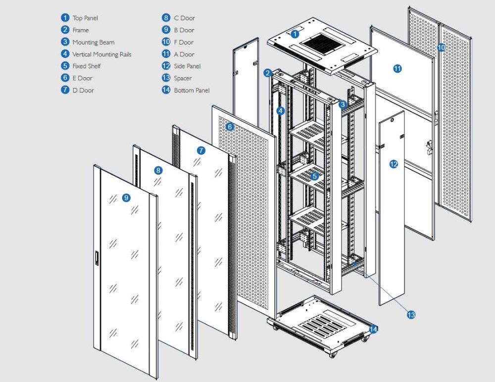
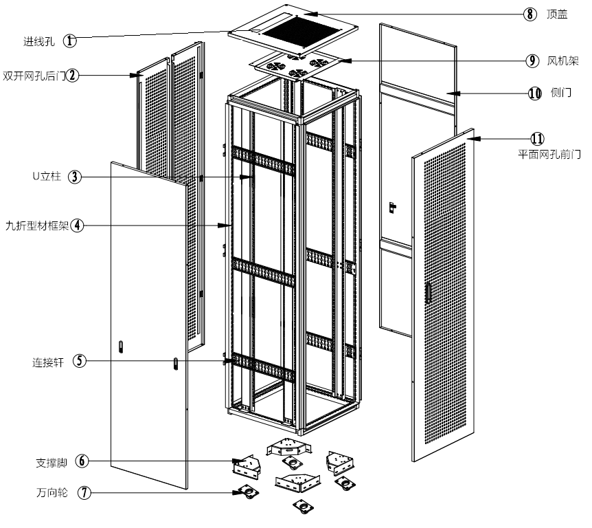
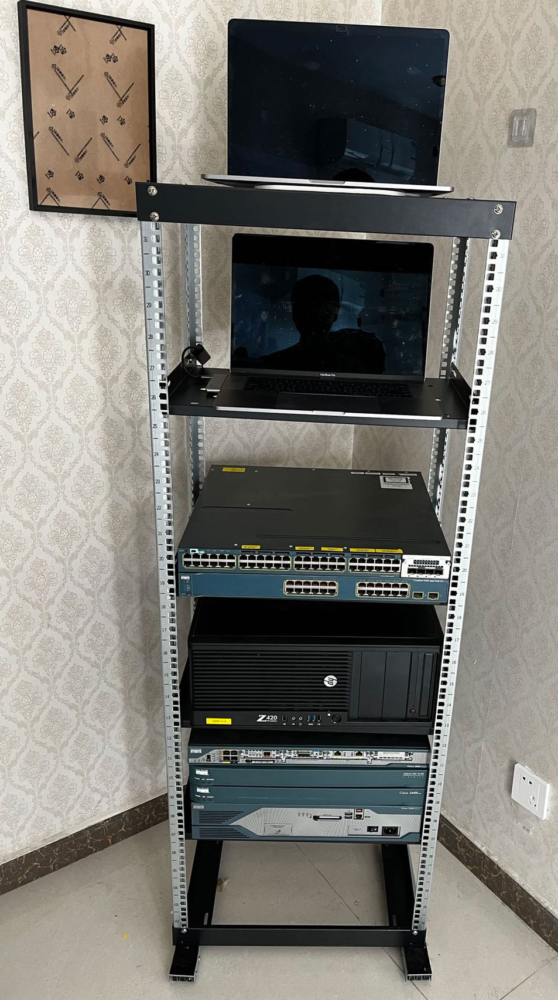

下面是标准的 IDC 机架结构示意图，结构比较复杂，发货它的所有功能需要机房的风火水电环境的各种支持。

下面这个标准规格【42u x 19 英寸】，最常见的服务器机架结构图，经常在办公室里，或者公司的专用服务器机房中可以看到。

显然以上两款功能过于复杂，并不适合在家庭使用；我个人比较偏爱 StarTech 公司的开放式机架。

但是，我发现 StarTech 公司的机架产品在国内没有代理商，在淘宝里也没有卖家。就算是有的话，价格也比较贵。不过它确实是国外 HomeLab 玩家评测的最多的。

总结一下我们置办家庭机架的几个所谓合理的动机：

* 整理收纳一定数量的电脑和网络产品，包括家用 NAS，wifi 和其他可能存在的新旧电脑（包括家用 PC、笔记本、服务器、网络设备等）。
* 给这些电子产品更好的运行环境，确保供电、散热、网络连接和安全性等需求。
* 让使用更加方便，需要开机的开机，用不到的关机省电。
* 正在或者希望最近 HomeLab 这个大坑。
* 希望使用本地虚拟机，降低或者避免使用云主机的成本。
* 其他特殊需求：一个炫酷的机架也是不错的网络直播演示环境和装饰背景。

下图是我的 HomeLab 机架的第一个版本。

设备包括：

* CCNA lab 测试设备一套。
* TrueNAS 服务器一台
* 四个旧树莓派
* 几个旧 MacBook Pro 电脑

这些版本基本上能满足以上列举的所有需求，成本可以忽略。缺点就是：它的承重能力有限，无法在堆放更多设备。由于疫情的原因，我需要把放在公司的四台PC服务器拿回家，方便使用。

由于比较很久国内品牌服务器机柜，他们都有各种规格的产品，很多人也都买这些成品机柜，到货开箱就可以使用，很方便。但是，我真的不喜欢有全封闭式机柜，坏处是：需要考虑散热制冷问题，而且不方便触达设备的各个侧面。

因此我只能求助与万能的淘宝，在研究了一段时间后，出手了。

这是第一次下单的产品，包括：

* 四根 32U 高的立柱：高度选择是机架搭建的最重要决策，考虑到扩展，应该至少准备 130% 的高度。 其次考虑深度，我铁定不想满全尺寸深度（600+mm）的设备，因此实际上搭建了一个：32U x 19 寸 x 19 寸的立方体，就是成品机柜中的瓤子，就是柜体里装的框架。
* 四个服务器托盘 ：如果设备可以上下堆叠的话，其实也不用这么多，但是考虑到分层，和物品的放置的话，需要计算好使用的个数。
* 四块盲板：是前后上下，将四根立柱连接起来的主要部件。
* 两幅服务器导轨：安装在了顶部和底部框架的侧面，将机架的前后链接起来，安装好这四根导轨，机架就可以站立起来了。居然前后左右都不摇晃，还比较的支棱 😄
* 一个理线架：其实不需要，由于你不可能有大量线需要整理，买多了。

销售以上产品的淘宝商家是：军臣机柜 1 店；前后从他们家下了两个单（320+38），第二个单补了四根导轨，起稳定机架，更合理的分层分区叠放设备的作用，释放托盘主要用于在开放层做物品的放置。安装起来后的效果如下。

在将设备放进去的过程中，你会发现几个问题：

* 洗衣机用移动滑轨无法胜任如此重量机架前后左右的快速移动，只能前后移动；需要一个稳定且方便移动的底座。
* 机柜封底后才能方便放置物品在上面。

解决方法：

1. 在淘宝里买了一块底座板，规格 2cm 厚 50cm x 50cm 的压缩板，到货后发现：其实坚固程度不输于实木板。够用。
2. 店家送了我四个万向轮，安装在底座板的四个角上，底座比机架大了一圈，既不占地方，也实现了稳定承载机架的目的，还可以四个方向顺滑的移动。
3. 用房间隔音装修剩下的隔音板封顶，规格合适：19 寸 x 19 寸。

下面是将所有设备上架，网络连接，通电后晚上的效果。

这里基本是我这么多年积累下来的所有 HumeLab 设备，堆叠在一起之后发现，我给自己挖的这个坑，还是挖的挺深的。

最后从几个方面讲讲阶段性的经验总结。

**电源供给**

1. 机架 PDU 好处多多，能用尽量用。
2. 我选择的 PDU A 前置：是一款 1U 高度，前面板 10 位独立开关，后身走电源线的，好处是省空间，后身走电源线更隐蔽、美观。但是需要重新买 10 根美标垂直三叉的电源线（5 根 1 米 + 5 根 1.5 米），富裕了 2 到三根供电位置。
3. 我选择的 PDU B 后置：是一款 2U 高度，8 位独立开关。目前有一个空位，电源插头供电位的需求远远比你想的多得多，除非设备不会在增加了，千万别想一个插排就搞定。
4. 可以安装在机架上的 PDU 优于家用的插排。整合性极佳，首选。
5. 安装一个 10 位的 USB 插排会很方便给树莓派、风扇、灯光设备的供电，一个插排位置就替代了 n 个 usb 变压器插头的需求。

**网络拓扑**

1. 核心以太网交换机：一个二手的 Cisco 48 口可管理千兆交换机，可划分 VLAN，属于 CCNA Lab 设备的一部分。
2. 万兆存储网交换机：一台 MikroTik 8 口 SPF+ 交换机，功能很强大，学习曲线陡。用于 TrueNAS 存储服务，和 Nutanix 超融合集群的组网。
3. 山泽 24 口配线架：用了以后才能理解配线架的底层逻辑，将所有设备都统一终结在这一级，然后就可以在机架前面，按标签快捷的给设备分配不同的网络。
4. 自己准备一卷网线制作条线：配合打线钳和测线器，买一盒 50 个的水晶头，做一些根跳线后，568B 线序就成了肌肉记忆了。推荐使用，虽然费事，但是可以让网线布线走向更加简洁。
   
**散热和制冷**

1. 我坚守避免使用高功耗全尺寸服务器的原则。只有这样才能房间环境散热，注意房间的正常通风即可。
2. 为设备按需增加和升级必要的风冷风扇。
3. 最耗电的是联想 P720 两路工作站，它是 Nutnaix 集群的一部分，升级了 CPU 的散热器，加装了机箱前置风扇，解决旧风扇导致的无法正常开机和运行中过热机器卡死的问题。
4. 最牛的是给 8 口 pfSense 防火墙工控机扇热的 USB 桌面小风扇，从家里小朋友哪里征用的。风量大几乎静音，基本上能秒掉各种尺寸和价格的 DIY 机箱用风扇，买过几个，噪音大的不能忍。
5. 常开的设备包括：TrueNAS 服务器和 48 口核心交换机和 MikroTik 万兆交换机。其他的设备按需开机，保持最小的功耗和发热量。

以上就是目前的经验总结分享，欢迎交流讨论。以后可能会以本文为大纲录制一期视频，在讲的细一些。